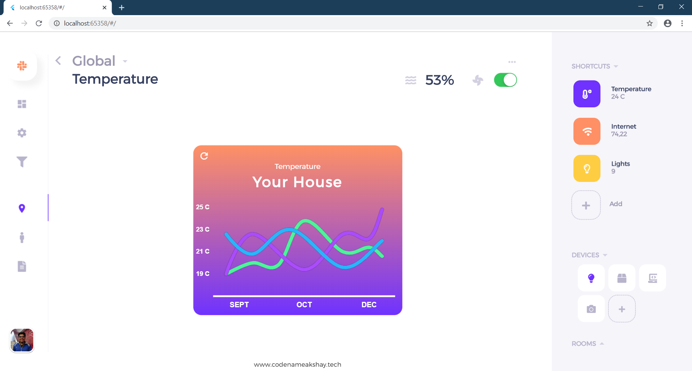
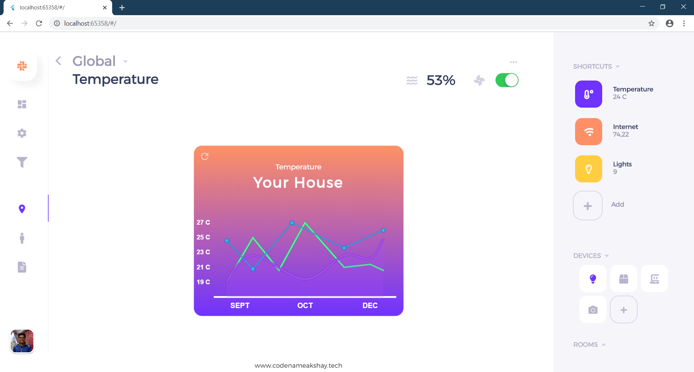

# Web-App UI

A sample smart home web app UI developed in Flutter, it implements neumorphic UI with responsive widgets and themes.

## Demo

## Usage
 
Simply clone the repo to get this UI.

This UI was inspired by [Dribble](https://dribbble.com/shots/6914699-Smart-Home-App/attachments).
